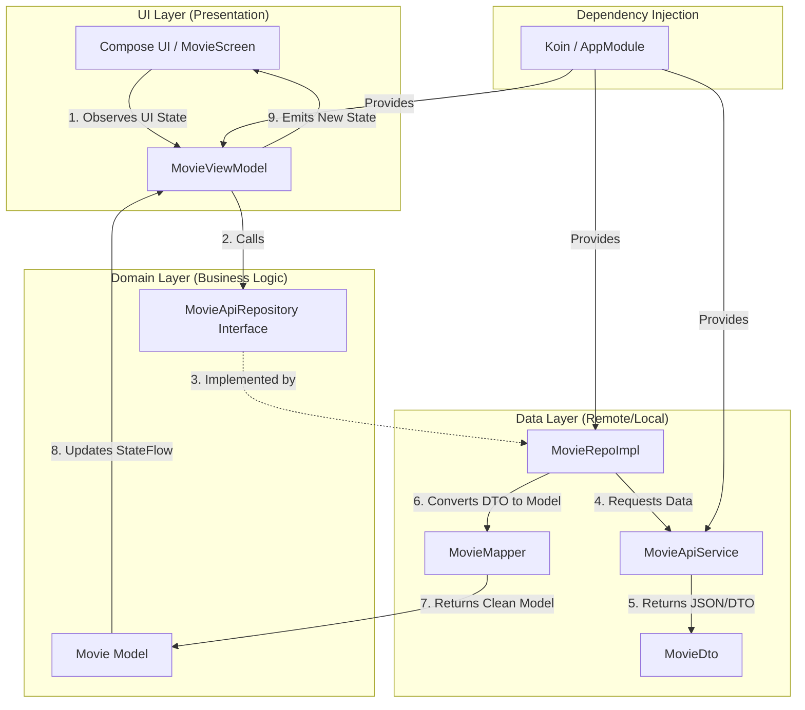

# Movie App

A high-performance Android application built with **Jetpack Compose** and **Ktor**, following the **MVVM** architecture to fetch and display movies from The Movie Database (TMDB).

## 🏗️ Architecture: MVVM (Model-View-ViewModel)

This project follows the **MVVM** design pattern, which is the recommended architecture for modern Android apps. Below is a detailed visualization of how data and events flow through the system.

### 📊 MVVM Data Flow Diagram

---

### 📂 Folder Structure & Responsibilities

Each folder in the `movieapi` package has a specific role in maintaining the separation of concerns:

#### 1. `ui/` (Presentation Layer)
- **`MovieScreen.kt`**: The "View". It is strictly responsible for rendering the UI based on the state provided by the ViewModel. It contains no business logic.
- **`MovieViewModel.kt`**: The "State Holder". It manages the `StateFlow` that the UI observes. It handles screen rotation and survives configuration changes.
- **`MoviesUiState.kt`**: Defines the different visual states (Loading, Success, Error).

#### 2. `domain/` (The Core)
- **`model/`**: Contains "Domain Models" (`Movie.kt`). These are clean Kotlin classes that represent the data the UI actually needs.
- **`repository/`**: Contains "Interfaces" (`MovieApiRepository.kt`). This defines a contract that the Data layer must follow, keeping the Domain layer independent of the network or database implementation.

#### 3. `data/` (Data Layer)
- **`remote/`**: Contains **DTOs** (`MovieDto.kt`). These are mirrors of the API's JSON structure. They are "dirty" because they depend on the API's naming conventions (e.g., `poster_path`).
- **`mapper/`**: Contains **Mappers** (`MovieMapper.kt`). These translate "dirty" DTOs into "clean" Domain models. This is where we add logic like prepending image URLs.
- **`repository/`**: Contains the **Implementation** (`MovieRepoImpl.kt`). This class orchestrates the data flow, calling the API and applying the mappers.

#### 4. `network/`
- **`MovieNetworkClient.kt`**: Configures the Ktor `HttpClient`, handling JSON serialization settings and timeouts.
- **`NetworkConstants.kt`**: A single source of truth for API keys, base URLs, and endpoints.

#### 5. `di/` (Infrastructure)
- **`AppModule.kt`**: The "Glue". It defines how to create and inject all the classes above using Koin.

---

## 🚀 Advanced Mobile Architecture: Clean Architecture

While this project uses MVVM, larger enterprise apps often adopt **Clean Architecture**. 

### Why is Clean Architecture considered "the best"?
1. **Independence**: The business logic doesn't know about the UI, the Database, or the Web Server. You could replace Compose with XML without touching your core logic.
2. **Testability**: Logic is separated into "Use Cases" (Interactors), allowing for 100% unit test coverage without an emulator.
3. **Scalability**: Multiple teams can work on different layers (Data vs UI) without stepping on each other's toes.

---

## 🛠️ Concepts Used
1. **Ktor**: Modern asynchronous HTTP client.
2. **Koin**: Pragmatic and lightweight Dependency Injection.
3. **Coil**: Coroutine-backed image loading for Compose.
4. **StateFlow**: Reactive state management.
5. **Sealed Interfaces**: Robust modeling of UI states.

---

## ⚙️ Setup
1. **Clone**: `git clone <repo_url>`
2. **API Key**: Add your TMDB API Key to `NetworkConstants.kt`.
3. **Run**: Build and run in Android Studio.
